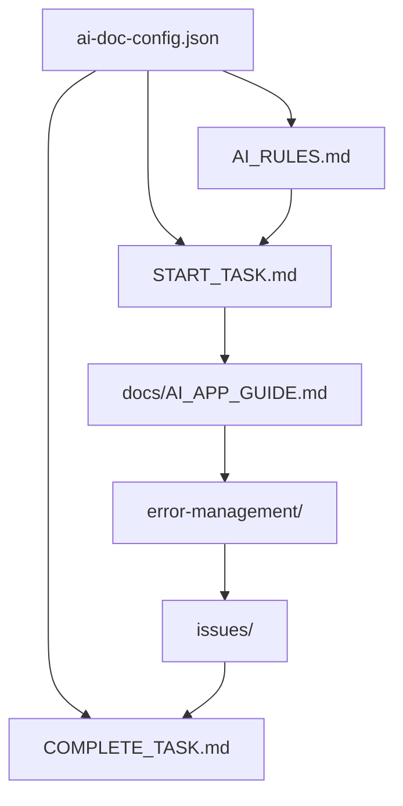

# 🏗️ AI Documentation Framework - Architecture Guide

> **Complete Guide to Understanding the Framework Architecture and File Placement**

## 📋 Table of Contents

- [🎯 Overview](#-overview)
- [📍 Critical File Placement](#-critical-file-placement)
- [🎯 ai-doc-config.json Deep Dive](#-ai-doc-configjson-deep-dive)
- [🔄 System Flow and Data Flow](#-system-flow-and-data-flow)
- [📊 File Relationships and Dependencies](#-file-relationships-and-dependencies)
- [🎨 Design Philosophy](#-design-philosophy)
- [🛡️ System Integrity and Validation](#️-system-integrity-and-validation)
- [📈 Scaling and Multi-Application Support](#-scaling-and-multi-application-support)
- [🔧 Troubleshooting Common Issues](#-troubleshooting-common-issues)

---

## 🎯 Overview

The AI Documentation Framework is designed with a **hierarchical, AI-optimized architecture** that ensures efficient documentation management while preventing token waste and system corruption.

### Core Principles

1. **🎯 Single Source of Truth**: All configuration in one central file
2. **🤖 AI-First Design**: Optimized for AI consumption and navigation
3. **🛡️ System Integrity**: Built-in validation and error prevention
4. **📈 Scalable**: Supports 1 to 100+ applications
5. **🔄 Token Efficient**: Minimal redundant information

---

## 📍 Critical File Placement

### 🚨 The Most Important File: `ai-doc-config.json`

This file is the **heart** of the entire framework and **MUST** be placed in your **project root**.

#### ✅ CORRECT Structure:
```
your-project/                     # 📍 PROJECT ROOT
├── 🎯 ai-doc-config.json         # 🏛️ THIS IS WHERE IT GOES!
├── 📄 AI_RULES.md               # AI behavior rules
├── 📄 START_TASK.md             # Task initialization
├── 📄 COMPLETE_TASK.md          # Task completion
├── 📄 CREATE_ISSUE_DIRECTORIES.md # Issue management setup
├── 📁 docs/                     # Project documentation
├── 📁 error-management/         # Error system
├── 📁 issues/                   # Issue tracking
└── 📁 [applications]/          # Your apps
    ├── website/
    ├── website-api/
    ├── email-server/
    └── robot-control-api/
```

#### ❌ INCORRECT Placement (Common Mistakes):

```
❌ your-project/
   ├── 📁 docs/
   │   └── ai-doc-config.json    # WRONG - Inside docs folder
   └── 📁 src/
       └── ai-doc-config.json    # WRONG - Inside src folder

❌ your-project/
   ├── 📁 ai-doc-framework/
   │   └── ai-doc-config.json    # WRONG - Inside framework folder
   └── 📁 config/
       └── ai-doc-config.json    # WRONG - In config folder
```

### Why Project Root is Critical

#### 1. **AI Accessibility**
```python
# AI can always find it at a predictable location
config_path = "./ai-doc-config.json"  # Always the same!
```

#### 2. **System Validation**
```python
def validate_system_integrity():
    critical_files = [
        "./ai-doc-config.json",    # ✅ Always in root
        "./AI_RULES.md",           # ✅ Always in root
        "./START_TASK.md"          # ✅ Always in root
    ]
```

#### 3. **Version Control**
```bash
# Easy to track configuration changes
git log --oneline ai-doc-config.json
```

#### 4. **Tool Integration**
```bash
# Tools always know where to look
python tools/setup-wizard.py  # Creates in project root
python tools/validator.py     # Validates from project root
```

---

## 🎯 ai-doc-config.json Deep Dive

### File Structure and Purpose

```json
{
  "project": {
    "name": "My Multi-App Project",
    "type": "multi",
    "root_path": "/path/to/project",
    "description": "Central project configuration"
  },
  "applications": [
    {
      "name": "website",
      "type": "frontend",
      "framework": "django",
      "description": "Main website application"
    },
    {
      "name": "website-api",
      "type": "backend",
      "framework": "fastapi",
      "description": "Backend API service"
    }
  ],
  "error_categories": [
    "backend", "frontend", "infrastructure",
    "security", "testing", "deployment"
  ],
  "issue_categories": [
    "incomplete-tasks", "unresolved-errors", "system-issues"
  ],
  "advanced_options": {
    "ai_model_preferences": ["gpt-4", "claude-3"],
    "auto_backup": true,
    "debug_mode": false
  }
}
```

### Section-by-Section Explanation

#### 1. **Project Section**
```json
"project": {
  "name": "My Multi-App Project",
  "type": "multi",           // single, multi, custom
  "root_path": "/path/to/project",
  "description": "Project description"
}
```

- **`name`**: Human-readable project name
- **`type`**: Determines framework behavior
  - `single`: One application
  - `multi`: Multiple applications
  - `custom`: Custom structure
- **`root_path`**: Absolute path to project root
- **`description`**: Project description for documentation

#### 2. **Applications Section**
```json
"applications": [
  {
    "name": "website",
    "type": "frontend",
    "framework": "django",
    "description": "Main website application"
  }
]
```

- **`name`**: Application identifier (used in file paths)
- **`type`**: Application type (frontend, backend, fullstack, etc.)
- **`framework`**: Technology stack (django, fastapi, react, etc.)
- **`description`**: Application purpose

#### 3. **Error Categories**
```json
"error_categories": [
  "backend", "frontend", "infrastructure",
  "security", "testing", "deployment"
]
```

Defines the error management structure:
```
error-management/
├── backend/
├── frontend/
├── infrastructure/
├── security/
├── testing/
└── deployment/
```

#### 4. **Issue Categories**
```json
"issue_categories": [
  "incomplete-tasks", "unresolved-errors", "system-issues"
]
```

Defines the issue tracking structure:
```
issues/
├── open/
│   ├── incomplete-tasks/
│   ├── unresolved-errors/
│   └── system-issues/
└── closed/
    ├── incomplete-tasks/
    ├── unresolved-errors/
    └── system-issues/
```

#### 5. **Advanced Options**
```json
"advanced_options": {
  "ai_model_preferences": ["gpt-4", "claude-3"],
  "auto_backup": true,
  "debug_mode": false,
  "custom_templates": false
}
```

- **`ai_model_preferences`**: Preferred AI models for tasks
- **`auto_backup`**: Automatic backup before changes
- **`debug_mode`**: Enable detailed logging
- **`custom_templates`**: Use custom templates

---

## 🔄 System Flow and Data Flow

### Task Execution Flow

```
1. 🎯 User Request → AI receives task
2. 📋 AI_RULES.md → AI reads behavior rules
3. 🎯 ai-doc-config.json → AI gets project structure
4. 📄 START_TASK.md → AI follows initialization protocol
5. 📚 docs/AI_APP_GUIDE.md → AI navigates documentation
6. 🚨 error-management/ → AI checks for similar errors
7. 📋 issues/ → AI checks for open issues
8. 🔧 Execute Task → AI performs the work
9. ✅ COMPLETE_TASK.md → AI follows completion protocol
```

### File Generation Flow

```
Setup Wizard
    ↓
ai-doc-config.json (created)
    ↓
Templates Applied
    ↓
├── AI_RULES.md (generated)
├── START_TASK.md (generated)
├── COMPLETE_TASK.md (generated)
├── docs/AI_APP_GUIDE.md (generated)
├── error-management/ (created)
├── issues/ (created)
└── Application Structure (created)
```

### Error Resolution Flow

```
Error Occurs
    ↓
AI searches error-management/
    ↓
Pattern Matching
    ↓
Similar Error Found?
├── Yes → Apply Known Solution
└── No → Document New Error
    ↓
Update error-management/
    ↓
Add to MASTER_ERROR_INDEX.md
```

---

## 📊 File Relationships and Dependencies

### Core Dependencies



### File Purpose Matrix

| File | Purpose | Dependencies | Generated By |
|------|---------|--------------|--------------|
| `ai-doc-config.json` | 🎯 Central Configuration | None | Setup Wizard |
| `AI_RULES.md` | 🤖 AI Behavior Rules | ai-doc-config.json | Templates |
| `START_TASK.md` | 🚀 Task Initialization | AI_RULES.md | Templates |
| `COMPLETE_TASK.md` | ✅ Task Completion | All files | Templates |
| `docs/AI_APP_GUIDE.md` | 🧭 Navigation Guide | ai-doc-config.json | Templates |
| `error-management/MASTER_ERROR_INDEX.md` | 🚨 Error Index | Error templates | Templates |
| `issues/ISSUE_TRACKER.md` | 📋 Issue Dashboard | Issue templates | Templates |

### Read Order for AI

```python
# Optimal reading sequence for AI
reading_sequence = [
    "ai-doc-config.json",           # 1. Get project structure
    "AI_RULES.md",                  # 2. Understand rules
    "START_TASK.md",                # 3. Follow initialization
    "docs/AI_APP_GUIDE.md",         # 4. Navigate documentation
    "error-management/",            # 5. Check errors if needed
    "issues/",                      # 6. Check issues if needed
    "COMPLETE_TASK.md"              # 7. Follow completion
]
```

---

## 🎨 Design Philosophy

### 1. **AI-First Design**
- **Token Efficiency**: Minimal redundant information
- **Predictable Structure**: Files always in expected locations
- **Clear Navigation**: AI can navigate without getting lost
- **Error Prevention**: Built-in validation prevents common mistakes

### 2. **Single Responsibility Principle**
- **One Purpose Per File**: Each file has a clear, specific role
- **Clear Boundaries**: No overlapping responsibilities
- **Easy Maintenance**: Changes are localized to specific files

### 3. **Fail-Safe Architecture**
- **Validation**: Every operation is validated
- **Error Recovery**: System can recover from common errors
- **User Alerting**: Users are informed of issues
- **Backup**: Automatic backups before destructive operations

### 4. **Scalability**
- **Horizontal Scaling**: Add more applications easily
- **Vertical Scaling**: Handle complex applications
- **Performance**: Optimized for large projects
- **Resource Management**: Efficient memory and disk usage

---

## 🛡️ System Integrity and Validation

### Integrity Checks

#### 1. **File Existence Validation**
```python
def validate_critical_files():
    critical_files = [
        "./ai-doc-config.json",
        "./AI_RULES.md",
        "./START_TASK.md",
        "./COMPLETE_TASK.md"
    ]

    for file_path in critical_files:
        if not exists(file_path):
            alert_user(f"Missing critical file: {file_path}")
            return False
    return True
```

#### 2. **Configuration Validation**
```python
def validate_ai_doc_config():
    required_sections = [
        "project", "applications", "error_categories", "issue_categories"
    ]

    config = load_json("./ai-doc-config.json")

    for section in required_sections:
        if section not in config:
            alert_user(f"Missing section in config: {section}")
            return False
    return True
```

#### 3. **Structure Validation**
```python
def validate_project_structure():
    required_dirs = [
        "./docs", "./error-management", "./issues"
    ]

    for dir_path in required_dirs:
        if not exists(dir_path):
            alert_user(f"Missing directory: {dir_path}")
            return False
    return True
```

### Error Prevention Mechanisms

#### 1. **Duplicate File Prevention**
```python
def prevent_duplicate_creation(file_path):
    if exists(file_path):
        error = "File already exists. Use existing file instead."
        log_error(error)
        return False
    return True
```

#### 2. **Path Validation**
```python
def validate_file_placement(file_path):
    # ai-doc-config.json must be in project root
    if "ai-doc-config.json" in file_path:
        if "/" in file_path or "\\" in file_path:
            error = "ai-doc-config.json must be in project root"
            log_error(error)
            return False
    return True
```

#### 3. **User Alerting System**
```python
def alert_user(message, severity="warning"):
    if severity == "critical":
        print(f"🚨 CRITICAL: {message}")
    elif severity == "warning":
        print(f"⚠️  WARNING: {message}")
    else:
        print(f"ℹ️  INFO: {message}")
```

---

## 📈 Scaling and Multi-Application Support

### Single Application Structure
```
single-app-project/
├── ai-doc-config.json
├── AI_RULES.md
├── START_TASK.md
├── COMPLETE_TASK.md
├── docs/
├── error-management/
└── issues/
```

### Multi-Application Structure
```
multi-app-project/
├── ai-doc-config.json          # Central configuration
├── AI_RULES.md                # Project-level rules
├── START_TASK.md              # Project-level tasks
├── COMPLETE_TASK.md           # Project-level completion
├── docs/                      # Shared documentation
├── error-management/          # Shared error system
├── issues/                    # Shared issue tracking
└── applications/              # Individual applications
    ├── website/
    │   ├── AI_RULES.md        # App-specific rules
    │   ├── START_TASK.md      # App-specific tasks
    │   ├── COMPLETE_TASK.md   # App-specific completion
    │   └── docs/              # App-specific docs
    └── website-api/
        ├── AI_RULES.md        # App-specific rules
        ├── START_TASK.md      # App-specific tasks
        ├── COMPLETE_TASK.md   # App-specific completion
        └── docs/              # App-specific docs
```

### Scaling Considerations

#### 1. **Performance**
- **Lazy Loading**: Files loaded only when needed
- **Caching**: Frequently accessed files cached
- **Indexing**: Error and issue files indexed for quick search
- **Compression**: Large files compressed for storage

#### 2. **Organization**
- **Modular Structure**: Each application is self-contained
- **Shared Resources**: Common resources shared across apps
- **Namespace Isolation**: Each app has its own namespace
- **Dependency Management**: Clear dependency relationships

#### 3. **Maintenance**
- **Version Control**: Each component versioned independently
- **Backup Strategy**: Incremental backups for large projects
- **Monitoring**: Performance monitoring for large installations
- **Documentation**: Auto-generated documentation for complex structures

---

## 🔧 Troubleshooting Common Issues

### Issue 1: "ai-doc-config.json not found"

#### Symptoms:
- Setup wizard fails
- Validation errors
- System cannot initialize

#### Solutions:
```bash
# 1. Check if file exists
ls -la ai-doc-config.json

# 2. Verify location (must be in project root)
find . -name "ai-doc-config.json" -type f

# 3. Re-run setup wizard
python tools/setup-wizard.py

# 4. Manual creation
cat > ai-doc-config.json << EOF
{
  "project": {
    "name": "My Project",
    "type": "multi",
    "root_path": "$(pwd)",
    "description": "Project description"
  },
  "applications": [],
  "error_categories": ["backend", "frontend"],
  "issue_categories": ["incomplete-tasks", "unresolved-errors"]
}
EOF
```

### Issue 2: "File already exists" errors

#### Symptoms:
- Cannot create new files
- Duplicate file warnings
- System integrity errors

#### Solutions:
```bash
# 1. Check for existing files
find . -name "*.md" -type f

# 2. Use existing files instead of creating new ones
# 3. Check AI_RULES.md for file creation rules
cat AI_RULES.md | grep -A 10 "File Creation"

# 4. Verify system integrity
python tools/validator.py --check-integrity
```

### Issue 3: Configuration validation fails

#### Symptoms:
- Config file format errors
- Missing required sections
- Invalid JSON structure

#### Solutions:
```bash
# 1. Validate JSON syntax
python -c "import json; json.load(open('ai-doc-config.json'))"

# 2. Check required sections
python -c "
config = json.load(open('ai-doc-config.json'))
required = ['project', 'applications', 'error_categories', 'issue_categories']
missing = [s for s in required if s not in config]
print('Missing sections:', missing)
"

# 3. Fix common issues
python tools/config-fixer.py
```

### Issue 4: Performance issues with large projects

#### Symptoms:
- Slow file loading
- High memory usage
- Long validation times

#### Solutions:
```bash
# 1. Enable caching
export AI_DOC_FRAMEWORK_CACHE=1

# 2. Use lazy loading
python tools/setup-wizard.py --lazy-load

# 3. Optimize configuration
python tools/optimizer.py

# 4. Monitor performance
python tools/performance-monitor.py
```

### Issue 5: Permission errors

#### Symptoms:
- Cannot write files
- Access denied errors
- Permission denied

#### Solutions:
```bash
# 1. Check file permissions
ls -la ai-doc-config.json

# 2. Fix permissions
chmod 644 ai-doc-config.json
chmod 755 tools/*.py

# 3. Check directory permissions
ls -ld .
chmod 755 .

# 4. Run as appropriate user
sudo -u $(whoami) python tools/setup-wizard.py
```

---

## 📞 Getting Help

### Documentation Links
- **Main README**: [README.md](README.md)
- **Installation Guide**: [INSTALL.md](INSTALL.md)
- **Usage Guide**: [USAGE.md](USAGE.md)
- **Configuration**: [CONFIGURATION.md](CONFIGURATION.md)

### Community Support
- **GitHub Issues**: [Report Issues](https://github.com/zsarir/ai-doc-framework/issues)
- **Discussions**: [Community Discussions](https://github.com/zsarir/ai-doc-framework/discussions)
- **Wiki**: [Documentation Wiki](https://github.com/zsarir/ai-doc-framework/wiki)

### Quick Commands
```bash
# Validate system
python tools/validator.py --full

# Fix common issues
python tools/fixer.py --auto

# Get help
python tools/setup-wizard.py --help
```

---

**🎯 This architecture guide ensures you understand exactly where every file goes and why the `ai-doc-config.json` placement is critical for system functionality.**

**📍 Remember: The `ai-doc-config.json` file belongs in your project root - it's the heart of the entire system!**
